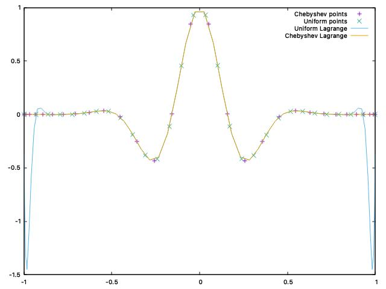
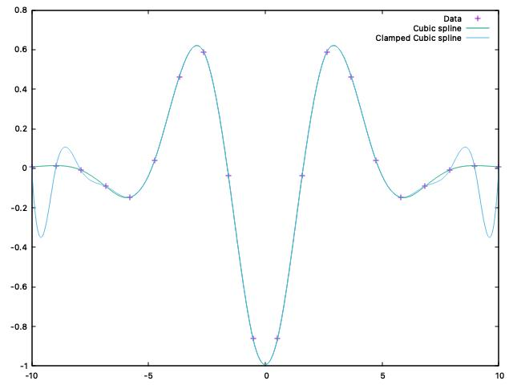

# Interpolation Project

## Overview

This project provides various interpolation methods and utilities. It includes custom exception handling, polynomial interpolators, and data readers.

## Structure

```
- include/: Contains header files for the project.
- src/: Contains the source code for the project.
- tests/: Contains unit tests for the project.
- docs/: Contains the generated documentation. (not included in the repository).
- datapoints/: Contains example data files for interpolation.
- build/: Directory where the project is built (not included in the repository).
```

<p align="center">
    
</p>

## Prerequisites

- C++20 or later
- CMake 3.10 or later
- Doxygen 1.8.20 or later
- Boost 1.75.0 or later

Make sure these dependencies are satisfied before building the project!

**Be carefull** with the Doxygen used for the documentation, it requires the `dot` package from `graphviz` in order to display
class dependency diagrams on the html doc website.

Furthurmore, some equations have been added to some functions descriptions, which requires a **full** install of `latex`. 
However, this **will not** cause documentatin to fail generating.

To install `graphviz`
```sh
sudo apt-get install graphviz
```

To install `latex` with all required dependencies:
```sh
sudo apt-get install texlive-full
```

## Compilation

To compile the project, follow these steps:

1. Clone the repository:
    ```sh
    git clone https://github.com/Alex0021/InterpolationProject.git
    cd InterpolationProject
    ```

2. Create a build directory and navigate into it:
    ```sh
    mkdir build
    cd build
    ```

3. Run CMake to configure the project:
    ```sh
    cmake ..
    ```

4. Build the project:
    ```sh
    make InterpolationProject
    ```

## Running the Project

To run the project, execute the following command **from the root directory** (the cloned repo).
```sh
./InterpolationProject
```

The project supports various command line arguments to plot data from files using different interpolator types. Below are the available options:

- `--help` Show the help message.
- `--file <path>` Specify the interpolation data file (relative path).
- `--lagrange` Use Lagrange interpolation.
- `--barycentric` Use barycentric interpolation.
- `--cubic_spline [NATURAL, CLAMPED] [CLAMPED_CONDITIONS]` Use cubic spline interpolation with specified boundary conditions.
- `--samples <int>` Number of sample to use for interpolating the datapoints

### Datapoints file format

The datapoints file should start with a header line specifying the number of points and the dimension of the data. The format is as follows:

```
# n m
```

Where `n` is the number of points and `m` is the dimension of each point.

Following the header, each line represents a single data point with `m` values separated by whitespace (spaces or tabs).

Example:
```
# 5 2
0.0 1.0
1.0 2.0
2.0 0.5
3.0 3.5
4.0 2.0
```

Ensure that the file does not contain any additional text or comments, as this will cause the program to fail when reading the data points.
### Typical Usage

To plot data using Lagrange interpolation:
```sh
./InterpolationProject --file datapoints/default.txt --lagrange
```

To plot data using cubic spline interpolation with natural boundary conditions:
```sh
./InterpolationProject --file datapoints/default.txt --cubic_spline natural
```

To plot data using cubic spline interpolation with clamped boundary conditions:
```sh
./InterpolationProject --file datapoints/default.txt --cubic_spline clamped -2 2
```

To plot data using multiple interpolators:
```sh
./InterpolationProject --file datapoints/default.txt --lagrange --barycentric --cubic_spline natural
```

### Some nice examples

The 2 examples below show different interpolation techniques approximating the `Damped Cosine` function.

1. Lagrange VS Chebychev

This illustrates how the sampling points matters for interpolation accuracy.
Generating these two different plots shows the difference:
```sh
./InterpolationProject --file datapoints/uniform_sampling.txt --lagrange --barycentric
./InterpolationProject --file datapoints/chebyshev_sampling.txt --lagrange --barycentric
```

<p align="center">
    
</p>

2. Natural VS Clamped cubic spline

This illustrates how the clamped version forces the 1st derivative to be equal to some specified value whereas the natural spline forces 2nd derivative to be equal to 0
```sh
./InterpolationProject --file datapoints/natural_vs_clamped.txt --cubic_spline natural
./InterpolationProject --file datapoints/natural_vs_clamped.txt --cubic_spline clamped -2 2
```

<p align="center">
    
</p>

2. Lagrange VS barycentric

This last example shows how the lagrange and barycentric performs the same. This is expected since it is exactly doing the same thing, just with different maths!
```sh
./InterpolationProject --file datapoints/lagrange_vs_barycentric.txt --lagrange --barycentric
```


## Running Tests

To run the tests, execute the following command make from the **build** directory:
```sh
make test
```

## Documentation

To build the documentation, execute the following make command from the **build** directory:

```sh
make doc
```

The project documentation is available in the `docs` directory.

To visualized the documentation webpage, open the `docs/html/index.html` file in your preferred web browser.

Example (with firefox on Linux):
```sh
firefox docs/html/index.html &
```

## Custom Exceptions

The project includes a set of custom exceptions defined in `include/project_exceptions.hpp`. These exceptions handle various error cases such as index out of bounds, size mismatch, and division by zero.

## License

This project is licensed under the MIT License. See the `LICENSE` file for details.
